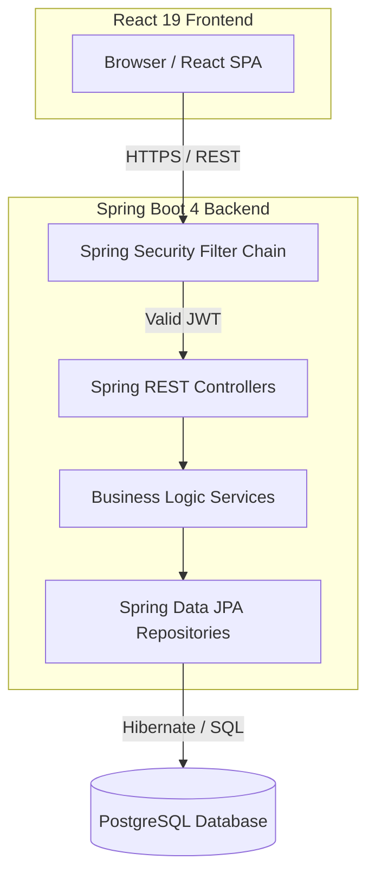
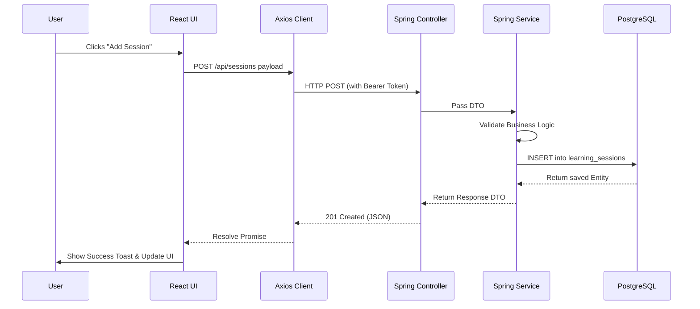
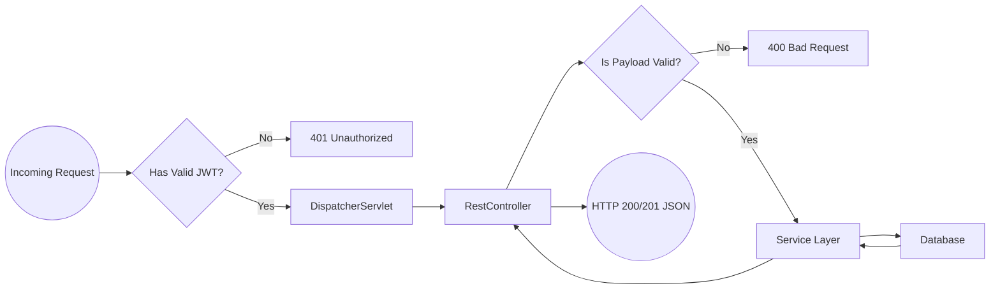
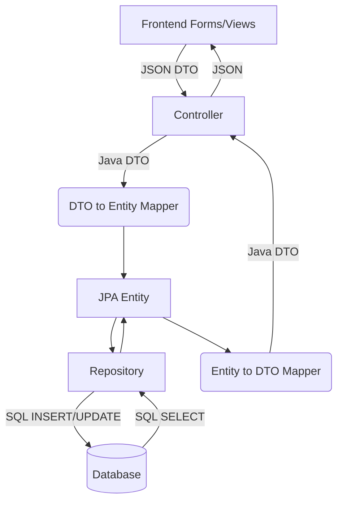
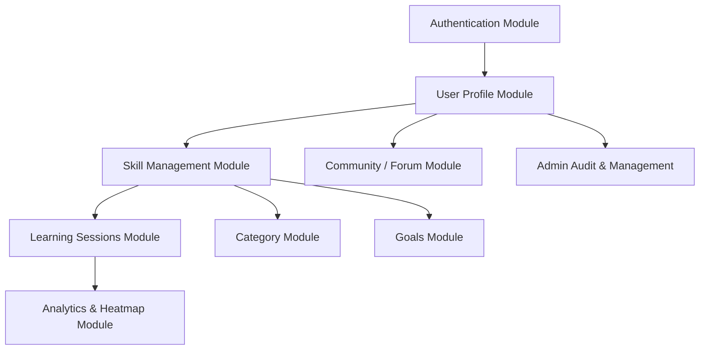
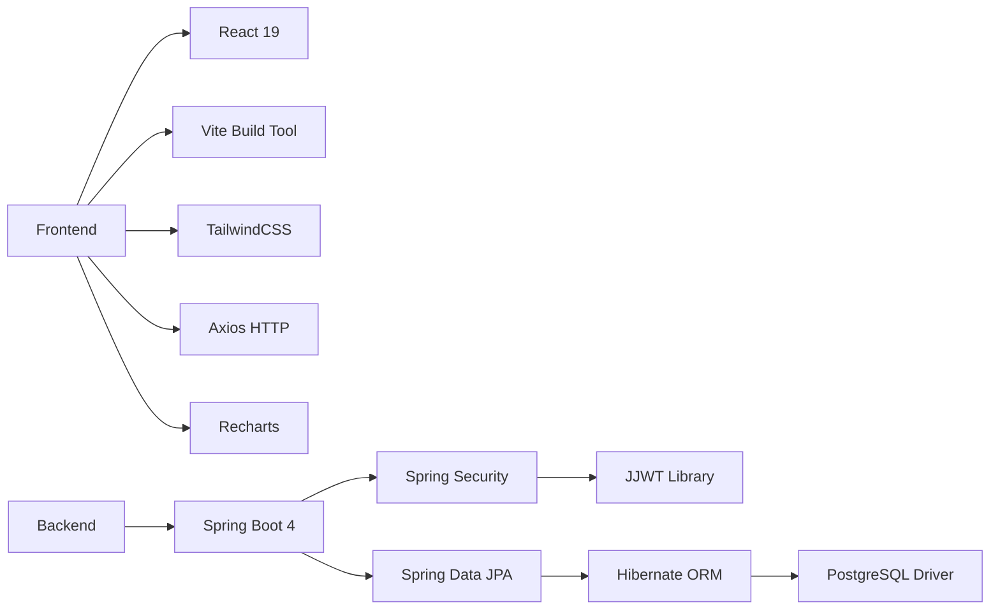
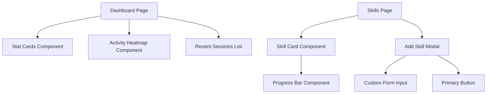

# 9. Architecture Diagrams

## System architecture diagram

## Frontend-backend communication diagram

## Request lifecycle diagram

## Data flow diagram

## Module interaction diagram

## Dependency graph

## Component interaction chart

