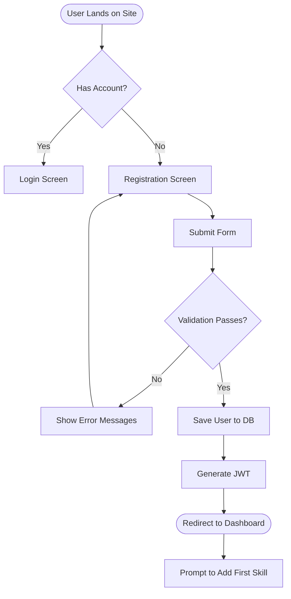
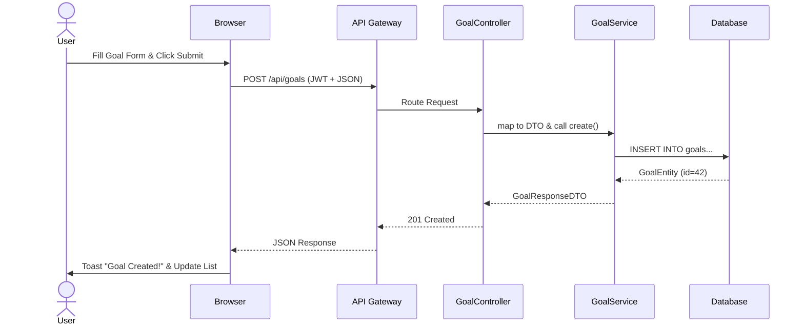
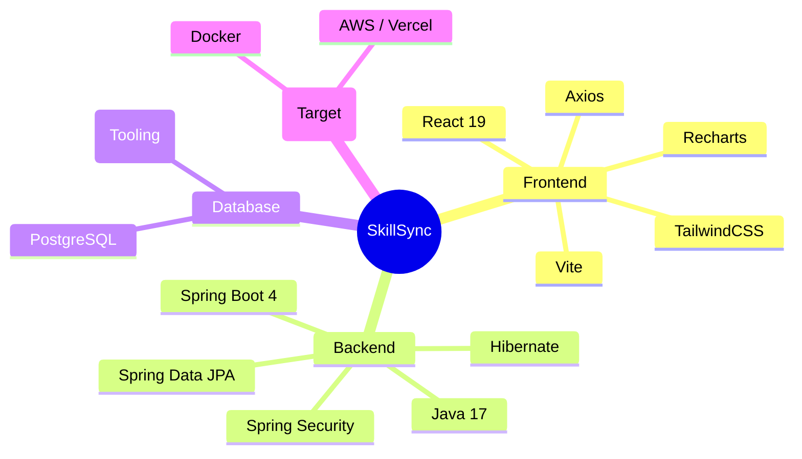
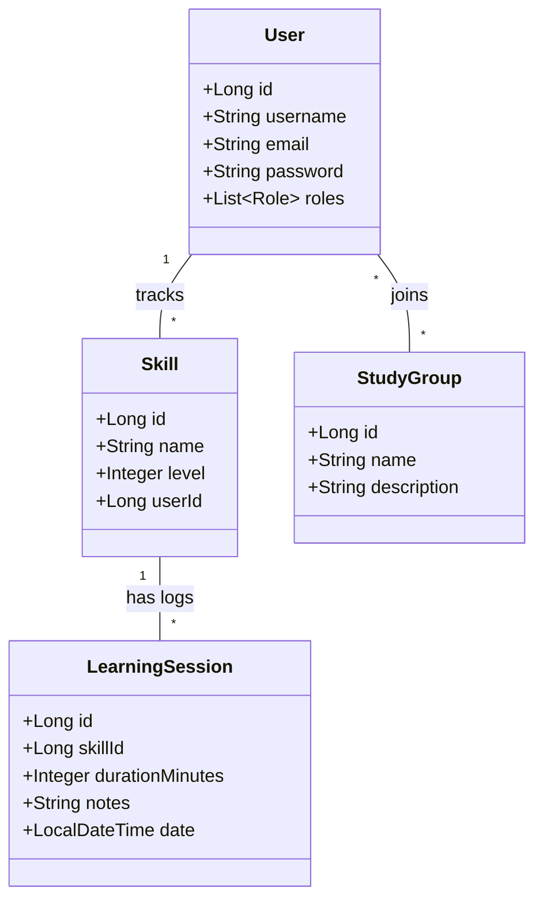
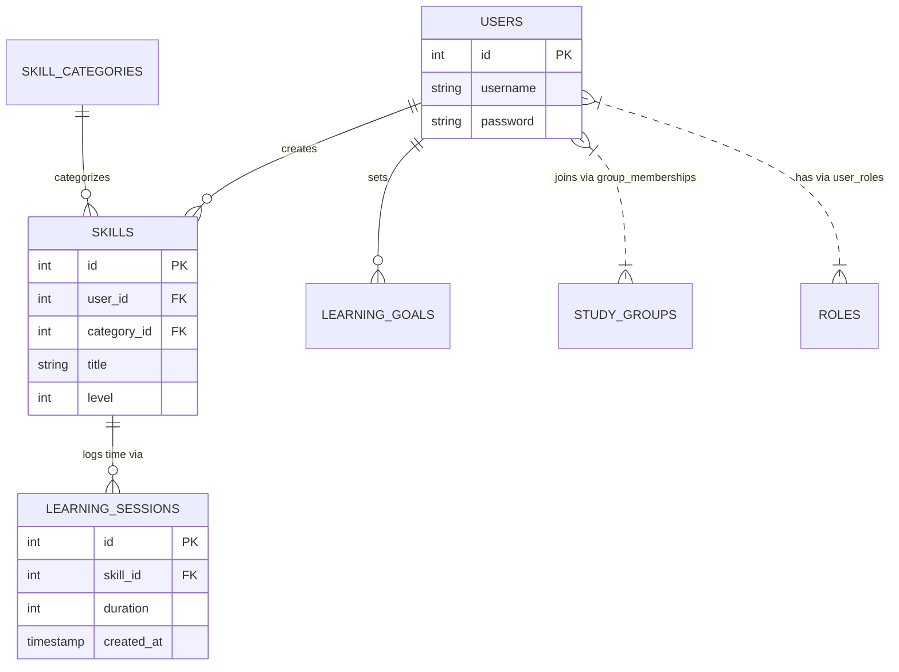

# 12. Visual Documentation

*(Note: These diagrams use Mermaid.js syntax. You can view them by rendering this markdown file in a compatible viewer like GitHub or a Mermaid live editor.)*

## 1. Flowchart: User Registration & Onboarding

## 2. Sequence Diagram: Creating a Goal

## 3. Architecture Chart: Tech Stack

## 4. Class Diagram (Backend Entities Snippet)

## 5. Entity Relationship Diagram (ERD)

